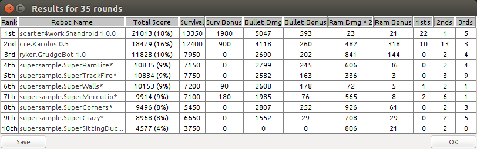

## Robocode VII, 2016

### Results
**First Place** ($500 - E-gineering)  
Scott Carter: Shandroid

**Second Place** ($300 - Moser Consulting)  
Chuck Eastus: Karolos

**Third Place** ($100 - Pinnacle Partners)  
Rick Ryker: GrudgeBot

**Pizza:** Moser Consulting  

### Sponsored by

# [![E-gineering][egineering_logo]][egineering]

# [![Moser Consulting][moser_logo]][moser]

# [![Pinnacle Partners][pinnacle_logo]][pinnacle]  

# [![Robert Half Technology][rht_logo]][rht]  

[rht]: http://www.roberthalf.com/indianapolis/technology-it
[rht_logo]: /sponsors/roberthalf.jpg

[pinnacle]: http://www.partnersinstaffing.com/
[pinnacle_logo]: /sponsors/pinnacle.png

[moser]: http://www.moserit.com/
[moser_logo]: /sponsors/moser.png

[egineering]: http://www.e-gineering.com/
[egineering_logo]: /sponsors/e-gineering.jpg
